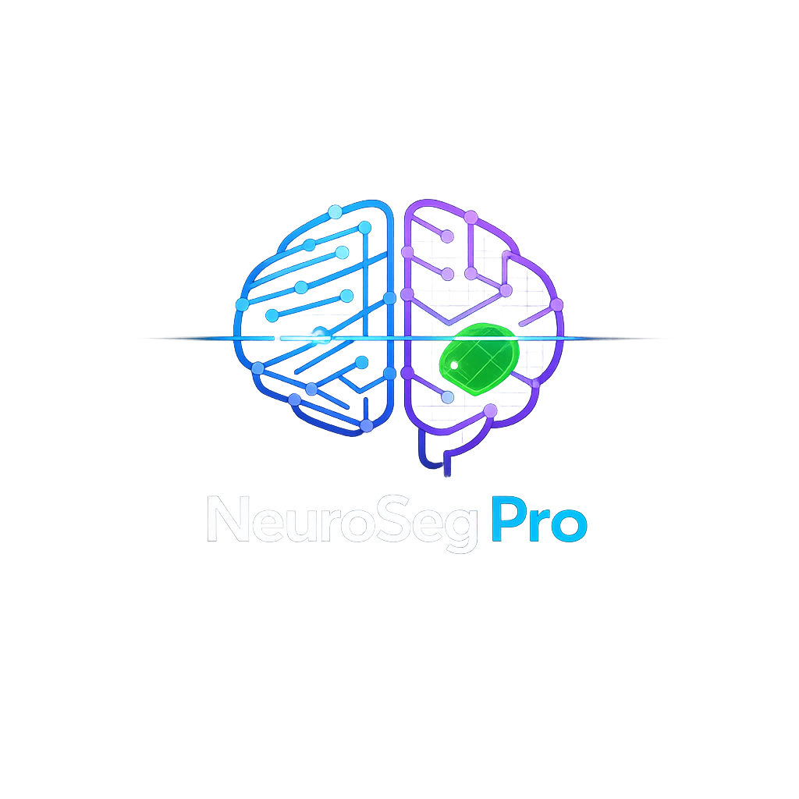

<div align="center">



# 🧠 NeuroSeg-Pro
**Advanced MRI Brain Segmentation & Visualization Toolkit**

[](https://www.python.org/downloads/)
[](https://pytorch.org/)
[](https://opensource.org/licenses/MIT)
[](#-quick-start-for-windows-users)

NeuroSeg-Pro is a seamless, highly intuitive PyQt5-based application designed for visualizing, comparing, and analyzing brain MRI segmentations utilizing advanced deep learning models. 

[Features](#-key-features) • [Installation](#-quick-start-for-windows-users) • [UI & Analysis](#-ai-analysis--validation) • [Contributing](#-contributing)
</div>

---

## ⚡ Quick Start for Windows Users

We've made getting started incredibly easy with our **fully automated installer**. You don't need to manually configure Python, pip, or PyTorch—the installer handles *everything*.

### **⬇️ [Download NeuroSegPro_Setup_v3.0.exe](https://github.com/mohany203/NeuroSeg-Pro/blob/main/dist/NeuroSegPro_Setup_v3.0.exe?raw=true)**

**Installation Steps:**
1. Download and run the **`NeuroSegPro_Setup_v3.0.exe`** installer.
2. The setup will automatically:
   - Install **Visual C++ Redistributable** (if missing).
   - Install **Python 3.11** system-wide (if missing).
   - Set up an isolated **Virtual Environment**.
   - Detect your hardware and download **PyTorch** (CUDA version if an NVIDIA GPU is detected, otherwise CPU version).
   - Create a convenient **Desktop Shortcut**.
3. Once complete, double-click the **NeuroSeg-Pro shortcut** on your desktop to launch!

> **Note:** Due to limits on repository size, pre-trained model weights (`.pth` files) are NOT included in this installer. **You must manually place your `.pth` model weights into the `models/` folder** located in the installation directory (usually `C:\Program Files\NeuroSeg-Pro\models`).

---

## 🚀 Key Features

### 👁️ Advanced Visualization
- **Multi-Planar Reconstruction (MPR):** Synchronized viewing of Axial, Sagittal, and Coronal planes.
- **Interactive 3D Viewport:** Explore generated segmentation masks in a full 3D interactive view.
- **Precision Tools:**
  - **Grid Overlay:** Visual grid for perfect structural alignment.
  - **Global Crosshair:** Navigate to precise voxel coordinates globally across all three MPR views.
  - **Opacity & Visibility Controls:** Hide the raw MRI background to focus exclusively on the segmentation mask.

### 🧠 AI Analysis & Validation
- **Dynamic Model Loading:** Seamlessly flip between different loaded deep learning models (e.g., Teacher/Student variants or varied epochs).
- **Comparison Modes:**
  - **Model A vs Model B:** Side-by-side segmentation comparison.
  - **Prediction vs Ground Truth:** Validate model outputs directly against expert-annotated labels.
  - **Overlay vs Raw:** Compare generated segmentations superimposed on raw scans.
- **Real-Time Clinical Metrics:** Instantly calculates crucial metrics on the fly including:
  - **Dice Coefficient (DSC)**
  - **Sensitivity & Specificity**
  - **Hausdorff Distance (95% HD)**

### 🎨 Premium User Interface
- **Modern "Deep Space" Dark Theme:** Crafted for professional medical image viewing aesthetics and to reduce eye strain.
- **Dynamic Legends:** The interface auto-updates to reflect the actual segmentation classes present in your current view.
- **One-Click Export:** Instantly export generated segmentation masks into standard `.nii.gz` format for clinical use or further downstream processing.

---

## 🛠️ Developer Setup & Source Code

If you prefer to run the code from source or wish to contribute:

```bash
# 1. Clone the repository
git clone https://github.com/mohany203/NeuroSeg-Pro.git
cd NeuroSeg-Pro

# 2. Run the automated setup script
# This script will safely install missing dependencies and set up the robust .venv
setup.bat

# 3. Launch the application
run_app.bat
```

> **Packaging Note:** To compile a new `.exe` installer yourself, run `python build.py` after ensuring you have Inno Setup Compiler installed.

---

## 📂 Project Architecture

```text
NeuroSeg-Pro/
 ├── app/                  # Main application source code
 │   ├── main.py           # Application entry point
 │   ├── ui/               # Widget panels, MPR views, and themes
 │   └── core/             # Model inference logic, NIfTI image processing
 ├── assets/               # Application icons and branding assets
 ├── models/               # (Git Ignored) Place your `.pth` weights here
 ├── model_output/         # Saved outputs from predictions
 ├── dist/                 # Contains compiled .exe installer
 ├── installer.iss         # Inno Setup compilation script
 ├── install.ps1           # Core logic for the automated setup process
 └── requirements.txt      # Python dependencies
```

---

## 👥 Meet the Team & Contributors

<div align="center">
<table>
  <tr>
    <td align="center"><a href="https://github.com/mohany203"><br /><sub><b>Mohamed Hany</b></sub></a></td>
    <td align="center"><a href="https://github.com/ASamy10"><br /><sub><b>Ahmed Samy</b></sub></a></td>
    <td align="center"><a href="https://github.com/Omareldash"><br /><sub><b>Omar Eldash</b></sub></a></td>
  </tr>
</table>
</div>

We welcome enhancements, bug fixes, and optimization tweaks to NeuroSeg-Pro! Please freely open an Issue or submit a Pull Request.

## 📄 License

This software is released under the **MIT License**. You are free to use, modify, and distribute it.
