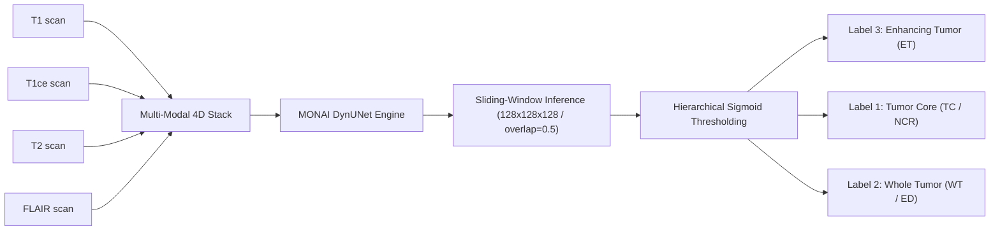

<div align="center">

# 🧠 NeuroSeg Pro
### Enterprise AI-Powered 3D Volumetric Brain Tumor Segmentation Suite

[](https://github.com/mohany203/NeuroSeg-Pro/releases/tag/v4.0.0)
[](#system-requirements)
[](#system-requirements)
[](#gpu--cuda-acceleration)
[](#clinical-segmentation-workflow)
[](LICENSE)

---

**NeuroSeg Pro** is an enterprise-grade clinical desktop suite engineered for rapid, automated 3D multi-modal MRI brain tumor segmentation. Leveraging state-of-the-art **MONAI DynUNet** architectures and hierarchical sigmoid post-processing, NeuroSeg Pro isolates and characterizes sub-tumoral regions with sub-voxel accuracy.

[📥 Download Windows Installer (v4.0.0)](https://github.com/mohany203/NeuroSeg-Pro/releases/download/v4.0.0/NeuroSegPro_Setup_v4.0.0.exe) • [📖 Read Documentation](https://github.com/mohany203/NeuroSeg-Pro#readme) • [🐛 Report Issue](https://github.com/mohany203/NeuroSeg-Pro/issues)

</div>

---

## 🌟 Executive Summary & Key Highlights

Version 4.0.0 introduces a redesigned, zero-friction Windows deployment pipeline and deep architectural optimizations:
* **⚡ Zero-Touch Automated Bootstrapper**: The installer automatically audits system health, acquires Python 3.11 silently if missing, provisions isolated `%LOCALAPPDATA%\NeuroSegPro\.venv` virtual environments, and installs required clinical deep learning toolchains.
* **📦 Intelligent Package Reuse**: Virtual environments utilize `--system-site-packages`, eliminating multi-gigabyte PyTorch/MONAI re-downloads on workstations where libraries or CUDA runtimes already exist.
* **🔕 Windowless Silent Execution**: Integrated VBS launcher (`NeuroSegPro.vbs`) launches the PyQt5 desktop suite cleanly without console command prompt windows or clutter.
* **🩺 Self-Healing Repair Tool**: Built-in automated diagnostic suite detects corrupted environments or deleted runtimes and provides instant GUI repair prompts (`install.ps1 -Repair`).
* **🔬 Accurate Volumetric Inference**: Fixed 6-stage DynUNet spatial bottleneck strides ($S/64 \rightarrow S/32 \rightarrow S/16 \rightarrow S/8 \rightarrow S/4 \rightarrow S/2 \rightarrow S$), enabling seamless 3D sliding-window segmentation on large NIfTI scans (`roi_size=128³`).

---

## 🎯 Clinical Segmentation Workflow

NeuroSeg Pro processes standard multi-parametric MRI sequences (`T1`, `T1ce`, `T2`, `FLAIR`) in NIfTI format (`.nii` / `.nii.gz`) and outputs hierarchical tumor sub-region masks adhering to international clinical standards:



### Tumor Sub-Region Priority & Mapping
1. **Label 3 (Enhancing Tumor - ET)**: High-priority hyper-intense regions on T1ce (overwrites all underlying labels).
2. **Label 1 (Non-Enhancing / Necrotic Core - NCR/NET)**: Core necrotic structures within the tumor margin.
3. **Label 2 (Peritumoral Edema / Whole Tumor - ED/WT)**: Surrounding FLAIR hyper-intense infiltrative edema.

---

## 🖥️ System Requirements

| Component | Minimum Specification | Recommended Clinical Workstation |
| :--- | :--- | :--- |
| **Operating System** | Windows 10 (64-bit) | Windows 11 Pro / Enterprise (64-bit) |
| **Processor** | Intel Core i5 / AMD Ryzen 5 (4 Cores) | Intel Core i7/i9 / AMD Ryzen 7/9 (8+ Cores) |
| **System Memory (RAM)**| 16 GB RAM | 32 GB+ RAM (for multi-modality 3D loading) |
| **Graphics Card (GPU)**| CPU Fallback Mode (No GPU required) | NVIDIA GeForce RTX 3060 / 4070 / RTX A2000+ (8 GB+ VRAM) |
| **CUDA Toolchain** | Not Required for CPU Mode | CUDA 11.8+ / 12.1+ Runtime Driver |
| **Storage Space** | 6.0 GB Free Disk Space | NVMe SSD with 10 GB+ Free Space |

---

## 🚀 Installation & Quick Start

### Step 1: Download the Installer
Download the compiled standalone Windows installer from our official GitHub Release:
👉 **[`NeuroSegPro_Setup_v4.0.0.exe` (2.89 MB)](https://github.com/mohany203/NeuroSeg-Pro/releases/download/v4.0.0/NeuroSegPro_Setup_v4.0.0.exe)**

### Step 2: Run the Setup Wizard
1. Double-click `NeuroSegPro_Setup_v4.0.0.exe`.
2. Accept the standard Windows User Account Control (UAC) Administrator prompt.
3. Choose your desktop icon preferences and click **Install**.

### Step 3: Automated Bootstrapping & Launch
Upon completion, the installer automatically triggers `install.ps1`, which orchestrates your local clinical runtime:
* Creates `%LOCALAPPDATA%\NeuroSegPro\.venv`.
* Acquires PyTorch (`torch-2.5.1+cu121`), MONAI, Nibabel, SciPy, and PyQt5.
* Registers `.nii` and `.nii.gz` file associations so you can open study files directly from Windows Explorer.

Launch the application via your Desktop Shortcut or Start Menu!

---

## 🏗️ System Architecture & Directory Structure

```text
C:\Program Files\NeuroSeg-Pro\          <-- Core Application Bundle
│
├── NeuroSegPro.vbs                     <-- Windowless Silent VBS Launcher
├── install.ps1                         <-- Intelligent Runtime Bootstrapper
├── app\                                <-- Python Application Source Suite
│   ├── main.py                         <-- Application Entrypoint
│   ├── core\
│   │   ├── custom_model.py             <-- DynUNet & ParallelQuantumBottleneck
│   │   ├── inference.py                <-- Sliding-Window Clinical Engine
│   │   └── loader.py                   <-- NIfTI Multi-Modal Reader
│   └── ui\                             <-- PyQt5 Themeable Interface Components
└── assets\                             <-- Icons and Visual Brand Styling

%LOCALAPPDATA%\NeuroSegPro\             <-- Isolated Runtime Environment
│
├── .venv\                              <-- Dedicated Python 3.11 Virtual Environment
└── logs\                               <-- Multi-Log Split Diagnostic Telemetry
    ├── bootstrap.log                   <-- Lifecycle & OS Audit Log
    ├── python_install.log              <-- Silent Acquisition Log
    └── gpu_audit.log                   <-- CUDA & PyTorch Engine Verification
```

---

## ❓ Troubleshooting & Frequently Asked Questions

<details>
<summary><b>Why did setup display "Runtime components have not yet been installed"?</b></summary>
<br/>
If your network connection dropped or antivirus blocked setup, simply double-click the <b>Repair & Maintenance Tool</b> shortcut in your Start Menu or run:
<code>powershell -ExecutionPolicy Bypass -File "C:\Program Files\NeuroSeg-Pro\install.ps1" -Repair</code>
</details>

<details>
<summary><b>Where can I inspect log files if installation fails?</b></summary>
<br/>
All diagnostic telemetry is persisted in plain-text inside your local profile:
<code>C:\Users\&lt;YourUsername&gt;\AppData\Local\NeuroSegPro\logs\bootstrap.log</code>
</details>

<details>
<summary><b>Does NeuroSeg Pro work on machines without an NVIDIA GPU?</b></summary>
<br/>
<b>Yes!</b> The inference engine automatically detects hardware capabilities. If CUDA is unavailable, it gracefully drops back to multi-core CPU sliding-window processing.
</details>

---

## 🛠️ Developer Setup & Contributing

If you wish to contribute to source code or build custom installers locally:

1. **Clone Repository**:
   ```powershell
   git clone https://github.com/mohany203/NeuroSeg-Pro.git
   cd NeuroSeg-Pro
   ```
2. **Stage Release & Compile Installer**:
   Ensure [Inno Setup 6](https://jrsoftware.org/isdl.php) is installed, then execute:
   ```powershell
   .\stage_release.ps1
   & "C:\Program Files (x86)\Inno Setup 6\ISCC.exe" installer.iss
   ```
   The compiled production installer will be output to `dist\NeuroSegPro_Setup_v4.0.0.exe`.

---

## 👥 Authors & Engineering Team

<table align="center" style="border: none; background: transparent;">
  <tr>
    <td align="center" width="220px">
      <a href="https://github.com/mohany203">
        <br />
        <br />
        <sub><b>Mohamed Hany</b></sub>
      </a><br />
      <small>Application Architect & GUI Suite</small>
    </td>
    <td align="center" width="220px">
      <a href="https://github.com/Omareldash">
        <br />
        <br />
        <sub><b>Omar Eldash</b></sub>
      </a><br />
      <small>AI Model & Volumetric Inference</small>
    </td>
    <td align="center" width="220px">
      <a href="https://github.com/ASamy10">
        <br />
        <br />
        <sub><b>Ahmed Samy</b></sub>
      </a><br />
      <small>Deep Learning & AI Training</small>
    </td>
  </tr>
</table>

---

## ⚖️ License
Distributed under the **MIT License**. See [`LICENSE`](LICENSE) for detailed terms.
